# Hertford & Ware Fundraising Group
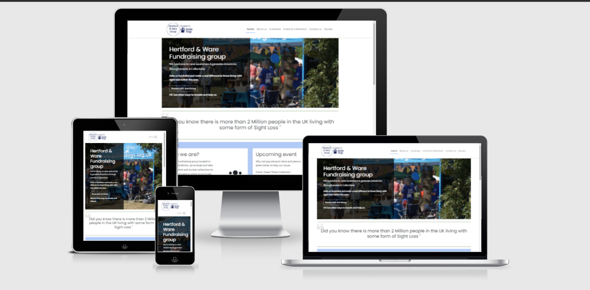  

Hertford & Ware Fundraising Group is a local volunteer run group located within Hertfordshire, the group fundraise to support the charatiable work of Guide Dogs for the Blind Association UK.  
[Live site](https://jhodgkins.github.io/MSP1-Fundraising-Group/)  
Developer: James Hodgkins  

## Table of contents
1. [Overview](#overview)
2. [Design brief](#design-brief)
3. [Research](#research)
4. [Goals](#goals)  
    4.1 [Project goals](#project-goals)  
    4.2 [User goals](#user-goals)  
    4.3 [Site owner goals](#site-owner-goals)  
    4.4 [Target audience](#trget-audience)  
5. [User experience (UX)](#user-experience-ux)  
    [User stories](#user-stories)  
    5.1 [First time visitor](#first-time-visitor)  
    5.2 [Returning user](#returning-user)  
    5.3 [Site owner](#site-owner)
6. [Design](#design)  
    6.1 [Structure of pages](#structure-of-pages)  
    - [Header section](#header-section)  
    - [Blockquote area](#blockquote-area)  
    - [Main content area](#main-content-area)  
    - [Secondary main content area](#secondary-main-content-area)  
    - [Footer section](#footer-section)  

    6.2 [Wireframe designs](#wireframe-designs)
    - [HomePage](#homepage)
    - [About us page](#about-us-page)
    - [Fundraise page](#fundraise-page)
    - [Events & Collections page](#events--collections-page)
    - [Contact us page](#contact-us-page)
    - [Donate page](#donate-page)  

    6.3 [Colour palette](#colour-palette)  
    6.4 [Typography](#typography)  
    6.5 [Icons and Imagery](#icons-and-imagery)
7. [Website features](#website-features)  
    7.1 [Existing features](#existing-features)  
    7.2 [Future features to be implemented](future-features-to-be-implemented)  
8. [Testing](#testing)  
9. [Technologies used](#technologies-used)  
    9.1 [Languages](#languages)  
    9.2 [Frameworks](#frameworks)  
    9.3 [Libraries](#libraries)  
    9.4 [Programs and online resources](#programs-and-online-resources)  
10. [Deployments](#deployments)  
    10.1 [Deploying to GitHub Pages](#deploying-to-github-pages)  
    10.2 [Forking the GitHub Repository](#forking-the-github-repository)  
    10.3 [Cloning to GitPod](#cloning-to-gitpod)  
11. [Credits and resources used](#credits-and-resources-used)  
    11.1 [Code snippets](#code-snippets)  
    11.2 [Omages and Icons](#images-and-icons)  
    11.3 [Content](#content)  
12. [Acknowledgments](#acknowledgments)

## Overview
The Hertford and Ware Fundraising Group fundraising site is a website catering for a local community group of volunteers located within east Hertfordshire, the areas they fundraise are Hertford, Ware and Welwyn Garden City.
The website has been developed with its main purpose to provide a platform for current group members to stay up to date with upcoming events and collections, a platform that they can easily share their fundraising activities with friends, family, and those within the community to encourage new recruits to the fundraising group.  
The business purpose of the platform is to demonstrate an established community fundraising group to entice and instil confidence to other groups, schools or businesses to collaborate and encourage donations from donors to support the fundraising groups cause.  
The sites expected target audience will be to those that would like to fulfil volunteering time through work, to persons who have more available spare time and are looking to meet or join a group of people from within the local community.  
The website will provide to new visitors a well-rounded positive feeling site demonstrating local community spirit which will inspire and promote a positive feeling whilst providing excitement for new opportunities for those visiting to become involved in volunteering as well as make a monitory contribution if they wish bringing a warm feeling that they have played their part to made a difference to someone living with a visual impairment.

## Design brief
Plan, design and build a website for a local community fundraising group to increase their presence and raise awareness of their fundraising cause within the local community area, which will help to increase recruitment volunteer numbers and direct donations to the fundraising group.

## Research
Please view the [research](docs/research.md) document for details.
## Goals
### Project goals
- The project will provide a platform for residents living within Hertford, Ware or Welwyn Garden City in Hertfordshire to stay up to date with the group’s activities.
- The project will promote the fundraising group and encourage new local volunteer members.
- The project will promote the national charity, the services it offers and help encourage new fundraising volunteers and opportunities within the local area.  
### User goals
-  Find information about what the fundraising group does
-  Find information about upcoming and past fundraising activities 
-  Find information about what the group can offer to groups, schools, or businesses
-  Find information about volunteering for the group
-  Find ways to support the fundraising group  
### Site owner goals
Hertford and Ware fundraising group is interested in raising awareness of the group’s activities and highlight the efforts to the local town areas they cover, Hertford, Ware and Welwyn Garden City.  
The fundraising group would also like to achieve additional goals which are:  
-  Recruit new volunteers:  
The group wish to increase their events and collections throughout the year, the addition of more members will allow the group to have enough volunteers available throughout the year to meet the volunteer volume needed at the additional events or collections.  
-  Increase annual income:  
The fundraising group would like to increase their yearly total raised to help with the groups continuation and better support the local and national community of visually impaired users.  
The increase of income will help open up new event opportunities or business collaborations due to being able to plan, attend larger events.  
### Target audience
-  People from the local area looking to volunteer and fundraise
-  People looking to donate to a local cause
-  People looking to find out more about local Guide Dog events or collections
-  Groups, schools, or businesses looking to organise an information event or talk
-  Groups, schools, or businesses looking to fundraise for a local charity

## User experience (UX)
During project planning, it was decided to set an aim that all User journeys should aim to be completed in 3 clicks or less to provide an overall good user experience and provide a positive feeling when navigating the site and reaching the users intended destintion.  
The site has also kept in mind visually impaired users as the website content relates to this area of disability, because of this all elements of the website are keyboard and screen reader accessible. 
### User stories 
#### First time visitor
-  As a first-time site visitor to the website, I want to understand what the site’s purpose is so that I can decide if it interests me
-  As a first-time site visitor, I want to be able to easily navigate the site so I can find the areas I am interested in.
-  As a first-time site visitor, I want to immediately understand what areas the group covers so that I can determine if I am local to the group.
-  As a first-time site visitor, I want to know more about the fundraising group
-  As a first-time site visitor, I want to find out how to volunteer
-  As a first-time site visitor, I want to get a feel of what to expect if I want to volunteer for the group
-  As a first-time site visitor, I want to be able to donate to the group
-  As a first-time site visitor, I want to be able to ask a question
#### Returning user
-  As a returning visitor, I want to see the latest upcoming event
-  As a returning visitor, I want to know what roles are currently available within the group
-  As a returning visitor, I want to be able to ask a question regarding a service or collaboration
-  As a returning visitor, I want to view photos of past events or collections
-  As a returning visitor, I want to visit the fundraising groups social media pages
-  As a returning visitor, I want to know how to book a talk from a speaker/GDO/Puppy walker for my group, school
#### Site owner
-  As the site owner, I want visitors to find information about upcoming events or collections
-  As the site owner, I want visitors to understand what the groups fundraising goals are, to find out more about the main charity and how it helps visually impaired people.
-  As the site owner, I want the site visitors to be able to contact the group regarding a service or ask a general question
-  As the site owner, I want site visitors to be able to donate to the group easily.

## Design
The design of the website was kept clean, clear to understand with header, hero section and footer kept consistent across pages for a good user experience (UX)  
The website is bright and cheerful to reflect the feel of the fundraising group.  
As a person with a visual impairment, the website was designed with screen magnification and screen readers in mind.  
### Structure of pages
The website uses a responsive mobile first layout approach which reflows to a maximum width of 1140px which becomes centre aligned on the page to maximise the users direct eye contact.  
#### Header section
The website has a left aligned logo from Mobile through to Desktop.
Located to the right is the main navigation, which is also responsive, this remains right aligned until tablet size where it will collapse to a right aligned Hamburger menu (toggle button).  
On devices tablet and below the user can expand/collapse the menu using the menu toggle button, the menu never obstructs site content instead pushes it down to reveal the full available menu items.  
#### Blockquote area
The blockquote area is used to display factual and motivational messages over various pages, the messages are used on the donate page for example to inform what a donation means to a charity, another example on the homepage is a factual quote from the NHS which totals the number of people living in the UK with a sight issue.  
#### Main content area
The main area changes it content based on the page selected from the navigation but remains consistent in its content presentation by providing a full width card or half page width card.  
This approach was decided upon so a user would know quickly how many areas were available to explore.  
The main content area has also been set with a consistent background surround to show clearly where the main page content starts and ends.  
#### Secondary main content area
This section always appears below the main content and is presented like the main content area with a surround colour to mark the area.  
This section holds complementary content based on the page selected and is used to add additional relevant areas of interest, the area shows two half page width cards on Desktop with the left card being highlighted as the most important card in this section.  
#### Footer section
The footer section was designed to be clean and useful; the footer displays with two half page sections both providing options for the user to interact with.  
The left side contains a simple but effective message asking if they have a question, the user can select the link to be directed to the contact form no matter the page they are on.  
The right side displays all available social media channels using social media icons, these links will enable a user to select a social media channel but remain on the current site as all external links open in a new window.  

### Wireframe designs
Wireframe designs show Mobile, Tablet and Desktop views.  
The site was developed using a mobile first approach.
#### HomePage

Mobile

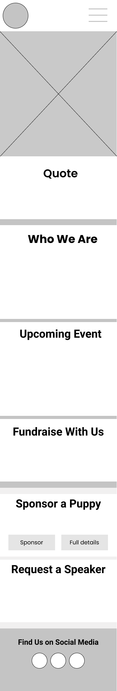

Tablet

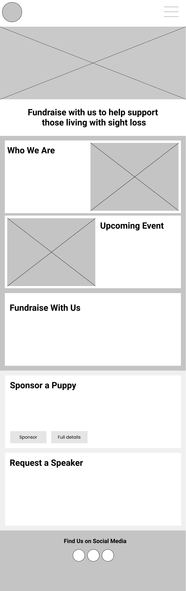

Desktop

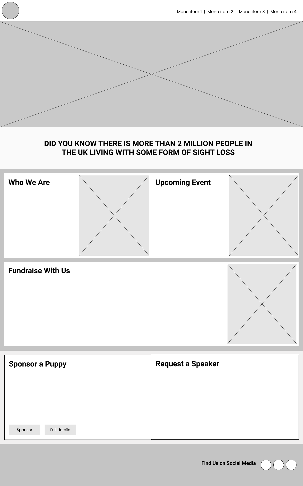

#### About us page

Mobile

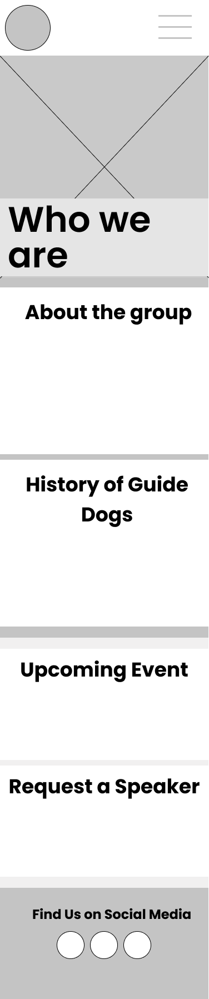

Tablet

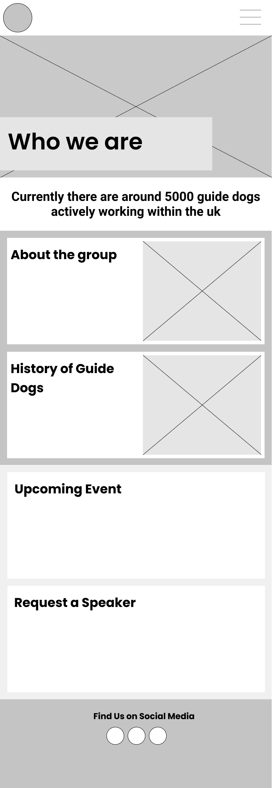

Desktop

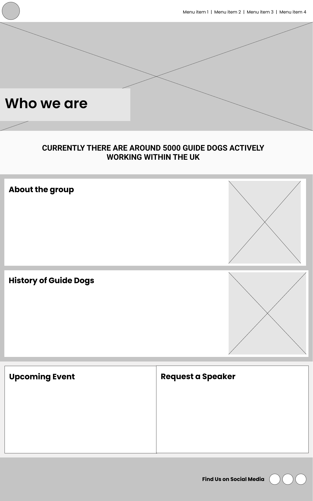

#### Fundraise page

Mobile

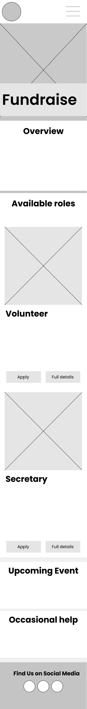

Tablet

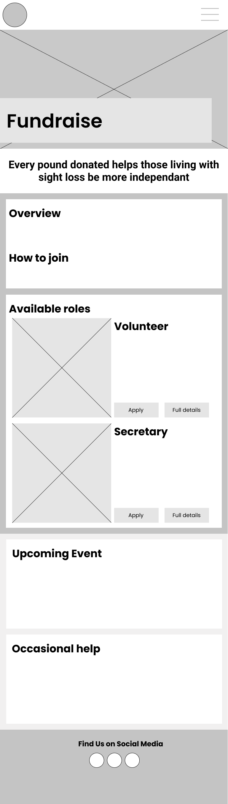

Desktop

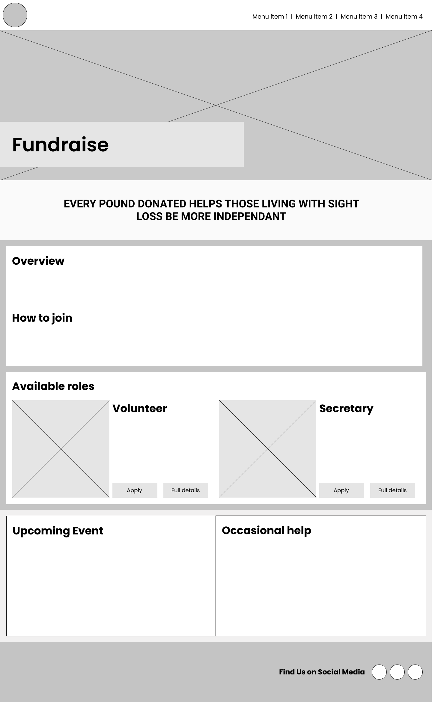

#### Events & Collections page

Mobile

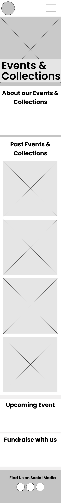

Tablet

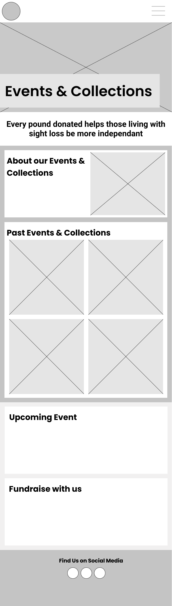

Desktop

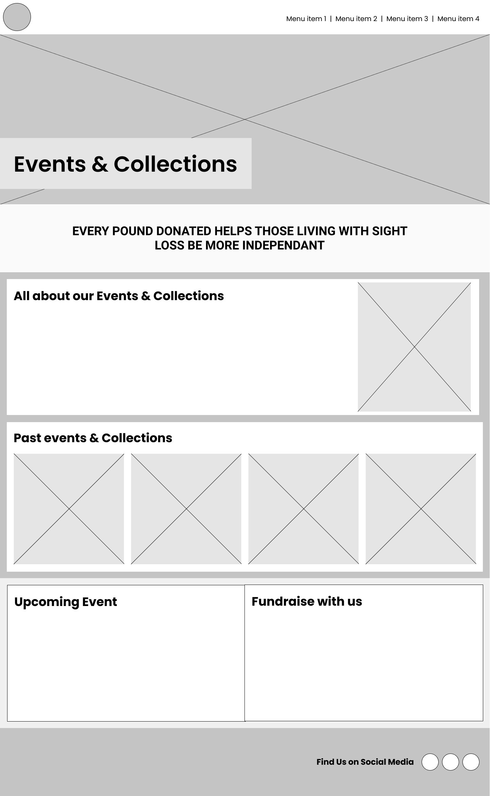

#### Contact us page

Mobile

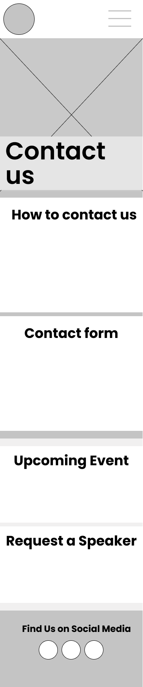

Tablet

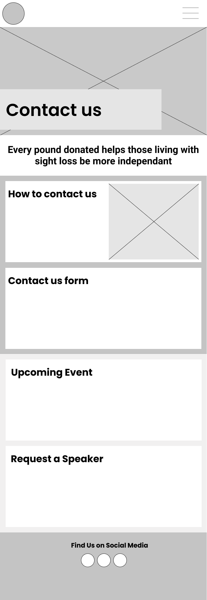

Desktop

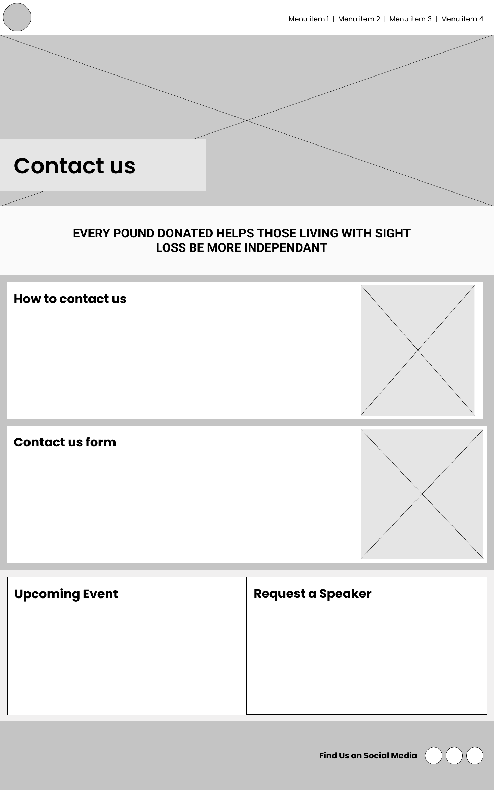

#### Donate page

Mobile

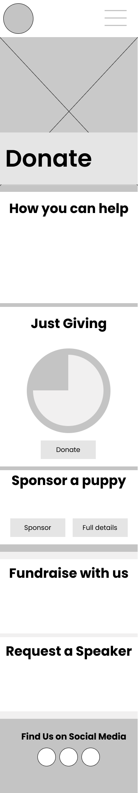

Tablet

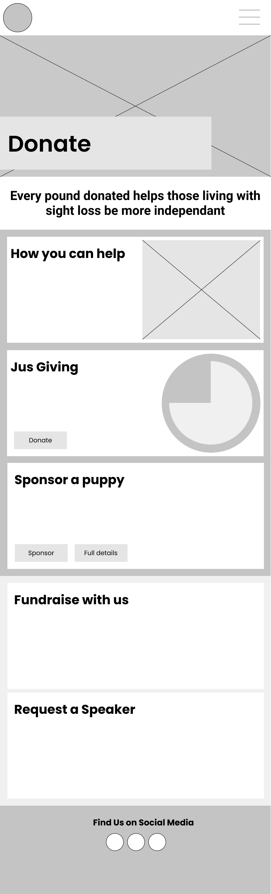

Desktop

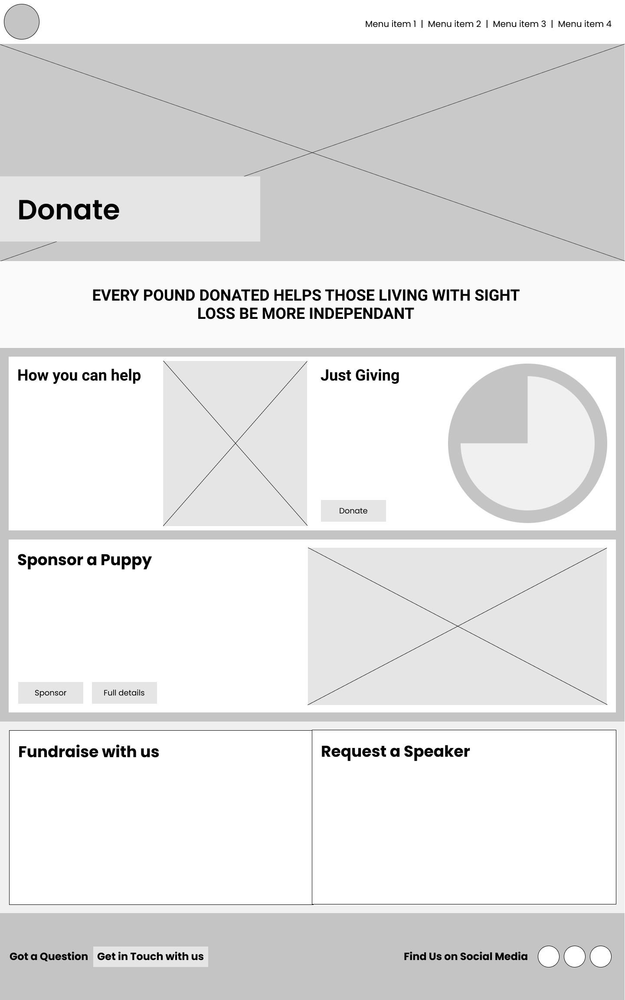
  

### Colour palette
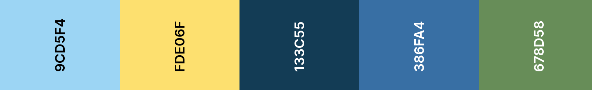  
-  Light Cornflower Blue: #9cd5f4 / rgb(100, 149, 237) was used as this represents the blue colour polo shirts worn by volunteers when fundraising.
-  Naples Yellow: #fde06f / rgb(253, 224, 111) was used to represent a yellow Labrador colour which is the common colour associated with Guide dogs who are seen in public  

The three remaining colours were taken from the hero image used across the website, they represent an outdoor scheme with a feeling of nature which match with the groups fundraising goals to help visually impaired people gain their freedom and independence.  
-  Indigo Dye: #133c55 / rgb(19, 60, 85)
-  Honolulu Blue: #386fa4 / rgb(56, 111, 164)
-  Russian Green: #678d58 / rgb(103, 141, 88)  

Other standard colours used were white and shades of black.  
I used a tool called Contrast Grid [view live colour palette](https://contrast-grid.eightshapes.com/?version=1.1.0&background-colors=&foreground-colors=%239cd5f4%0D%0A%23fde06f%20%0D%0A%23133c55%0D%0A%23386fa4%0D%0A%23678d58%0D%0A%23ffffff%0D%0A%23000000&es-color-form__tile-size=compact&es-color-form__show-contrast=aaa&es-color-form__show-contrast=aa&es-color-form__show-contrast=aa18) to determine the foreground and background combinations to ensure a minimum contrast ratio of 4.5:1 was maintained.  
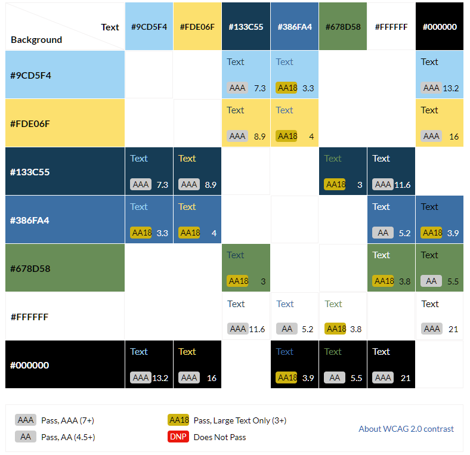  

### Typography
The fonts used across the site were provided by Google fonts and were used in certain areas as to maintain readability.  
There were two font families used, Source Sans Pro and Poppins, both fonts have a default fall-back of Sans-Serif which is available on all operating systems.  
Heading elements of the site used: Source Sans Pro with Poppins being used across the remainder of site elements, to improve readability for magnification users, the base font size was set to 18px from the browser default 16px.  

### Icons and Imagery
The icons used across the website were provided by Font Awesome free icon set.  
Each icon was selected to represent the heading title as to aid users with certain neurological disabilities to recognise the meaning of the section contents.  
Icons were also chosen as they are scalable and can be scaled to high magnification levels and remain clear and sharp.  

  
-  Paw – Represents a dog paw print
-  Microphone-alt – Represents a microphone a speaker would use
-  Users – Represents a group of users
-  User-friends – Represents users who are friends, this also represents a group of volunteers.  
-  Coins – Represents collection or donation
-  Paperclip – Represents a relation to office or admin role
-  Hands-helping – Represents someone helping someone
-  Question-circle – Represents a sign to help answer a question
-  Social media icons for Facebook, twitter and Instagram were also used.  

## Website features
This section looks at features which are implemented and those that when further technologies are learnt and introduced will add to the current state and functionality of the website.
### Existing features
-  Responsive website which will reflow up to 500% zoom using browser zoom.  
-  Responsive navigation menu bar
-  HTML form validation with visual feedback given through on screen icons.  
-  Animated circle progress bar indicating visually donation percentage goal.  
-  Responsive embedded video player
-  Responsive masonry image gallery which spans from 1 column through to 4 columns on desktop resolutions.  
-  100% accessible using a screen reader

### Future features to be implemented
-  Improve the HTML form by adding server-side scripting to handle message request and send a user email to confirm receipt of message request.
-  Improve form error messages by using JavaScript to validate form and provide custom feedback messages.
-  Implement an API call to Just Giving to return real time donation amounts to users on the website.
-  Implement a carousel showing services of interest within the hero section of the website.
-  Implement a database with a mail server to collect and distribute monthly newsletters to signed up users.
-  Implement a map generation widget to identify the location of events and embed a google map for users to plan their route to the event.  

## Testing
Due to the size of the testing document, it has been seperated into a seperate [TESTING](docs/testing/TESTING.md) document.

## Technologies used
A list of all technologies and software and online resources used to create the website.  
### Languages
-  [HTML](https://en.wikipedia.org/wiki/HTML5)  
-  [CSS](https://en.wikipedia.org/wiki/CSS)  
### Frameworks
-  [Bootstrap version 4.6](https://getbootstrap.com/)  
### Libraries
-  [Font Awesome](https://fontawesome.com/), Icons used throughout the site
-  [Google fonts](https://fonts.google.com/), Source sans pro and Poppins fonts were used across the site.  
-  [jQuery](https://jquery.com/), bundled with Bootstrap CDN for its elements function
### Programs and online resources
-  [favicon.io](https://favicon.io) used to create a site favicon.
-  [GitHub](https://github.io), was used to store committed files
-  [Git](https://git-scm.com/) and [GitPod](https://gitpod.io/), used in conjunction through Gitpod to commit and push files to GitHub
-  [Photoshop 2021](https://adobe.com), used for cropping, resizing and editing of photos and screenshots
-  [Figma](https://www.figma.com/), used to create the wireframe designs of the website
-  [Colour scheme](https://coolors.co/9cd5f4-fde06f-133c55-386fa4-678d58), used to create a colour palette
-  [Lighthouse](https://developers.google.com/web/tools/lighthouse), used to test performance, accessibility, best practices, and SEO within the Chrome browser.
-  [Am I Responsive](http://ami.responsivedesign.is/), used for generating the main README image.
## Deployments
Below are the steps to Deploy, Fork and Clone.
### Deploying to GitHub Pages
This project was deployed to GitHub Pages using these steps.
1.	Log in to GitHub and then locate the GitHub Repository
2.	On the top menu of the Repository, code is selected in the menu at the right is the "Settings" Button, select this link on the menu.
3.	Settings will open, scroll down the Settings page until you find the "Pages" Section.
4.	Under "Source", select the dropdown which displays "None" and select "Main".
5.	The page will automatically refresh.
6.	Scroll back down through the page to locate the now published site link in the "GitHub Pages" section, this will take a few minutes before the link shows your page.
### Forking the GitHub Repository
Forking a GitHub Repository will make a copy of the original repository on your GitHub account to view, edit or make changes without worrying about affecting the original repository.
1.	Log in to GitHub and locate the GitHub Repository you wish to fork
2.	At the top of the Repository, to the right above the "Settings" link on the menu, locate the "Fork" Button and select.
3.	You should now have a copy of the original repository within your GitHub account.
### Cloning to GitPod
1.	Go to [gitpod.io](https://gitpod.io)
2.	Create an account or sign in
3.	Open a new window and navigate to the extension store of your browser
-   [Chromium browsers](https://chrome.google.com/webstore/detail/gitpod-online-ide/dodmmooeoklaejobgleioelladacbeki)
-   [Firefox](https://addons.mozilla.org/firefox/addon/gitpod/)
4.	Accept permissions for the extensions and then return to the repository you wish to clone.
5.	There should be a green Gitpod button now located to the right, selecting this will open GitHub new repository screen.
6.	Create a new repository and Gitpod will launch your new repository into the user interface.
## Credits and resources used
### Code snippets
-  Responsive video CSS code was used from this tutorial site [Responsive Video tutorial](https://avexdesigns.com/blog/responsive-youtube-embed*/)  
-  Pie chart code was used from this tutorial and was modified to meet the websites needs, [Pie chart tutorial](https://www.geeksforgeeks.org/how-to-create-a-pie-chart-using-html-css/)  
### Images and Icons
-  Main hero image used across the site and the contact us photograph of a guide dog owner and his guide dog were taken by the developer J Hodgkins, who is also the owner of the guide dog.  
-  Icons used were Font Awesome Free fonts   
-  In support of Guide Dogs logo next to fundraising group logo is provided by Guide Dogs through their VIP area for volunteer resources.  
### Content
-  Blockquote ‘In the UK, there are almost 2 million people living with sight loss. Of these, around 360,000 are registered as blind or partially sighted.’ Was used from [NHS UK](https://www.nhs.uk/conditions/vision-loss/#:~:text=In%20the%20UK%2C%20there%20are,as%20blind%20or%20partially%20sighted) 

## Acknowledgments
Thank you to my Tutor Philip Morris, and my mentor Chris Quinn, they both have never questioned my ability even with a disability.  
I want to thank my wife Jeanmarie and my children for allowing me the spare time to take on this new challenge and for believing in me.  

Everyone at Code Institute who has helped and my class at Harlow College.
