# Testing Document

This document details how Hertford and Ware Fundraisng group website was tested to ensure it is complient and meets good user experiance (UX) whilst being as accessible to all its users.  

## Table of contents
 
1. [User stories testing from the UX section](#user-stories-testing-from-the-ux-section)  
    2.1 [First time visitor](#first-time-visitor)  
    2.2 [Returning visitor](#returning-visitor)  
    2.3 [Site owner](#site-owner)  
2. [Testing overview](#testing-overview)  
3. [Test results overview](#test-results-overview)  
4. [Validation Testing](#validation-testing)  
    4.1 [HTML Validation](#html-validation)  
    4.2 [CSS Validation](#css-validation)  
5. [Manual tests](#manual-tests)  
    5.1 [Browser Render & Responsive test](#Browser-Render--Responsive-test)  
    5.2 [Link testing](#link-testing)  
    5.3 [Tab order test](#tab-order-test)  
    5.4 [Landmarks test](#landmarks-test)  
    5.5 [Screen reader testing](#screen-reader-testing)  
6. [Automated tests](#automated-tests)  
    6.1 [Lighthouse](#lighthouse)  
    6.2 [Simulated device testing](#simulated-device-testing)  
7. [Issue tracking](#issue-tracking)  

## User stories testing from the UX section

### First time Visitor

-  __As a first-time site visitor to the website, I want to understand what the site’s purpose is so that I can decide if it interests me__  
When a new visitor arrives at the site, they will immediately see the logo which reads ‘Hertford & Ware Group’, with a supporter logo placed in proximity which reads ‘In support of Guide Dogs’.  
Just below this our large Hero banner image which grabs the users attention and reads ‘Hertford & Ware Fundraising Group’ which is followed by introductory text.  
A new visitor would be immediately aware of the websites purpose using these elements.  
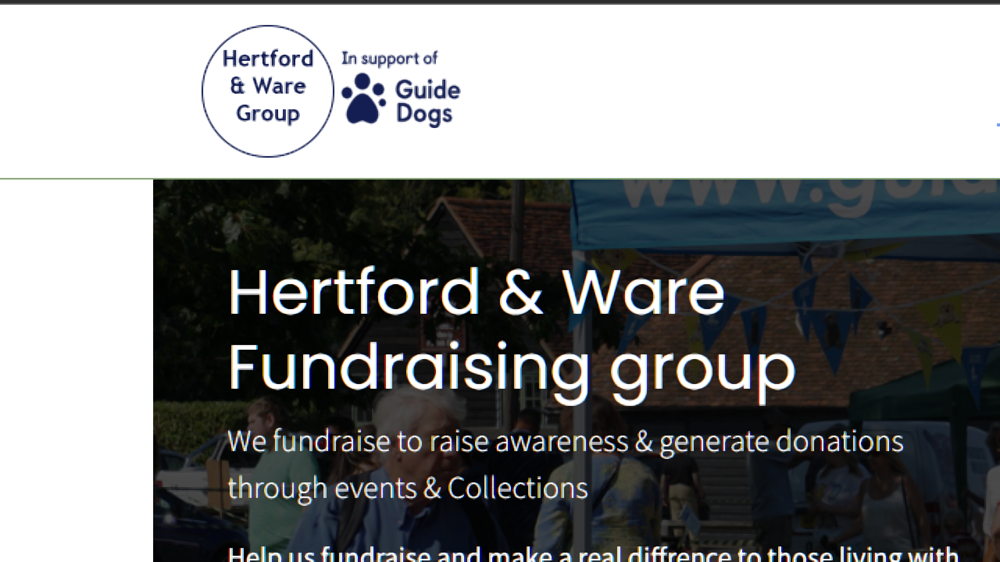  

-  __As a first-time site visitor, I want to be able to easily navigate the site so I can find the areas I am interested in.__  
Located on every page in a standardised place, top right-hand side of the screen are six links, these are clearly visible with a highlighted border below the Homepage link to show its active state.  
Move mouse to the top right and select a link or tab through the navigation links.  
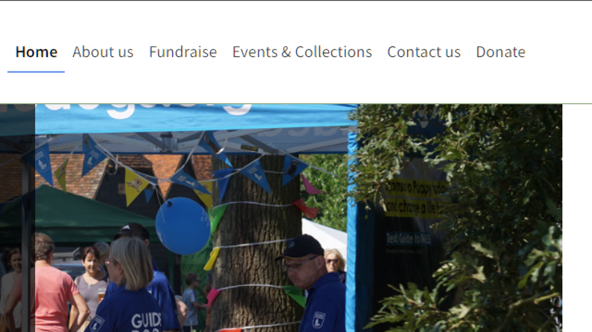  

-  __As a first-time site visitor, I want to immediately understand what areas the group covers so that I can determine if I am local to the group.__  
The Hero banner plays an important role by showing the towns that the group cover, there is also a short introduction titled Who we are just below the Hero image which details information relating to the areas in which the group cover.  
When page loads, eyes should be drawn to the large heading level 1 group name.  
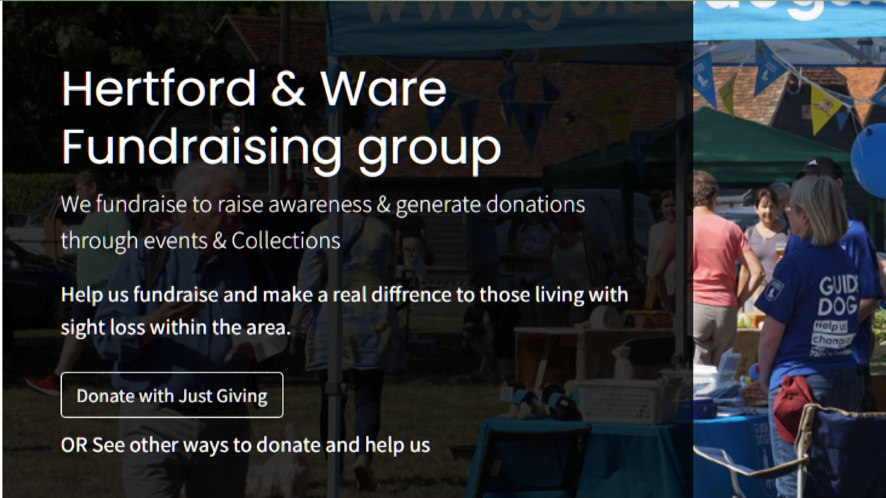  

-  __As a first-time site visitor, I want to know more about the fundraising group__  
Located just below the Who are we paragraph is a link to a more detailed explanation, alternatively the visitor can use the main navigation and select About us  
When page loads, scroll a small amount and select Find out more about us.  
When page loads move mouse or press tab key two times to land on the About us navigation link.  
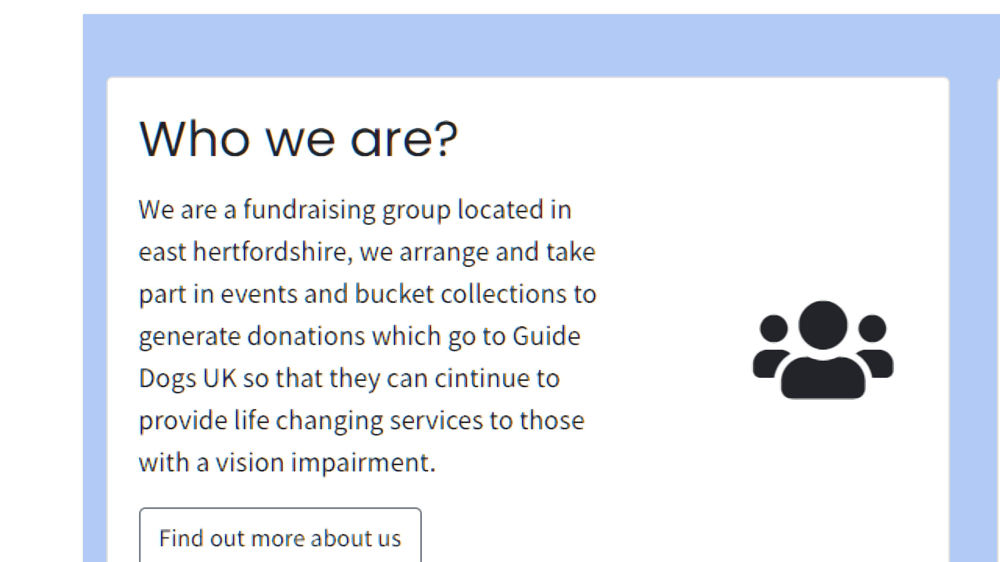  

-  __As a first-time site visitor, I want to find out how to volunteer__  
The main navigation holds a Fundraise link which leads to information about fundraising.  
Homepage, there is a large full width card with a Fundraise with us heading and link to take the user to the fundraise page.  
Events & collections and Donate pages have a card above the footer with a Fundraise for us heading and link to the fundraise page.  
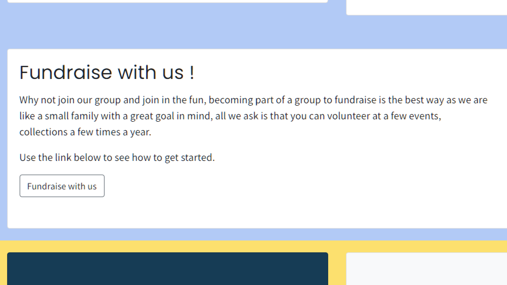  

-  __As a first-time site visitor, I want to get a feel of what to expect if I want to volunteer for the group__    
Using the navigation to select events and collections the user will be taken to a page where it details what happens at events and collections including a photo gallery to view.  
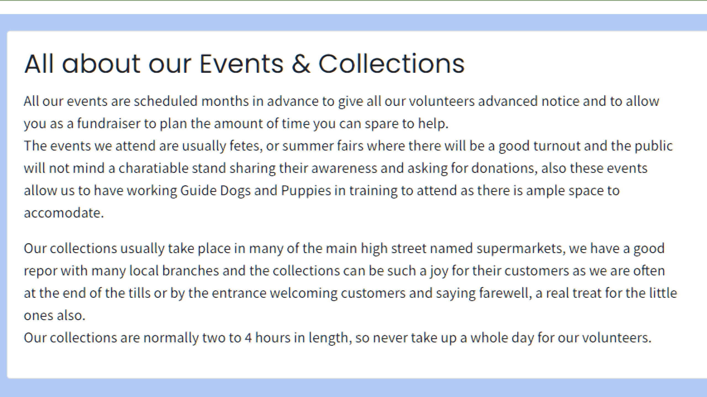  

-  __As a first-time site visitor, I want to be able to donate to the group__  
Select the Donate link in the main navigation which will show all ways to donate to the cause.  
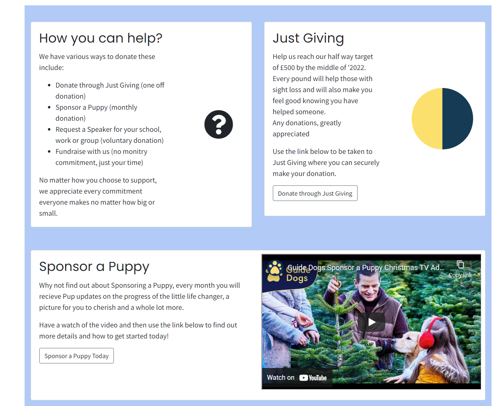  
 
-  __As a first-time site visitor, I want to be able to ask a question__  
Located in the main navigation is a link to the contact us page, there is also a section in the footer which is present on all pages which says Got a question.  
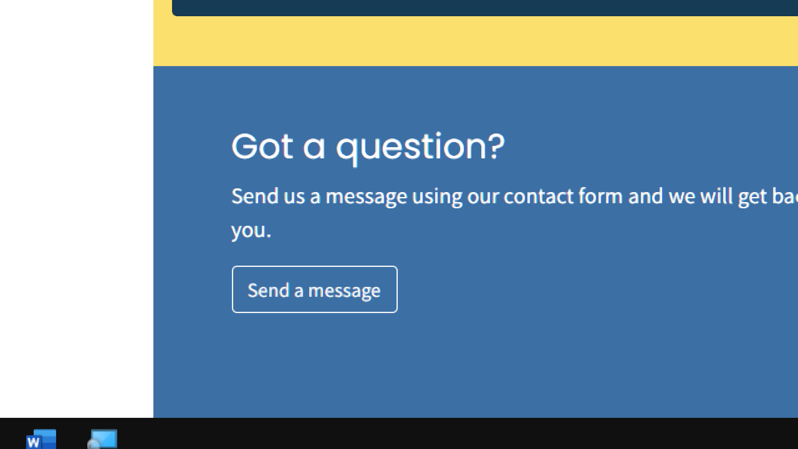  

### Returning Visitor

-  __As a returning visitor, I want to see the latest upcoming event__  
Located on the homepage a returning visitor will be able to see the next upcoming event or collection.  
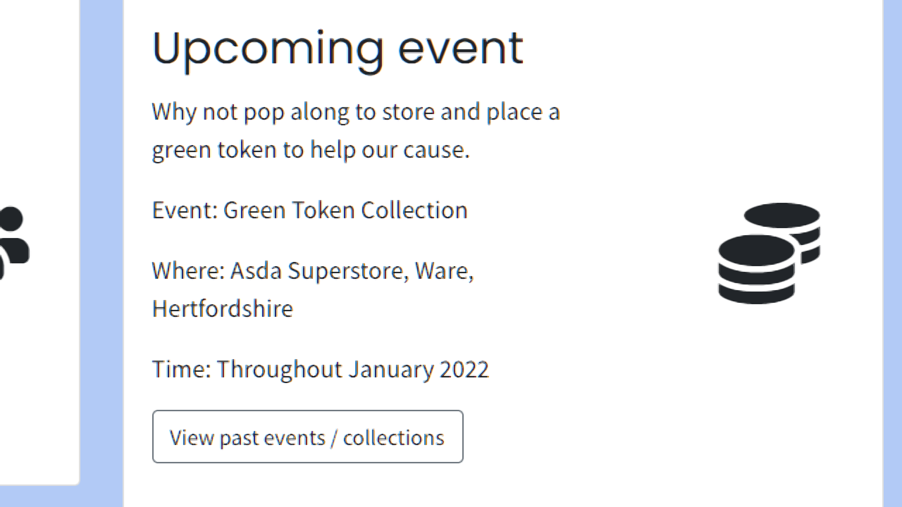  

-  __As a returning visitor, I want to know what roles are currently available within the group.__  
Located on the main navigation is a link to the fundraise page which gives a user all the necessary links to sign up and volunteer.  
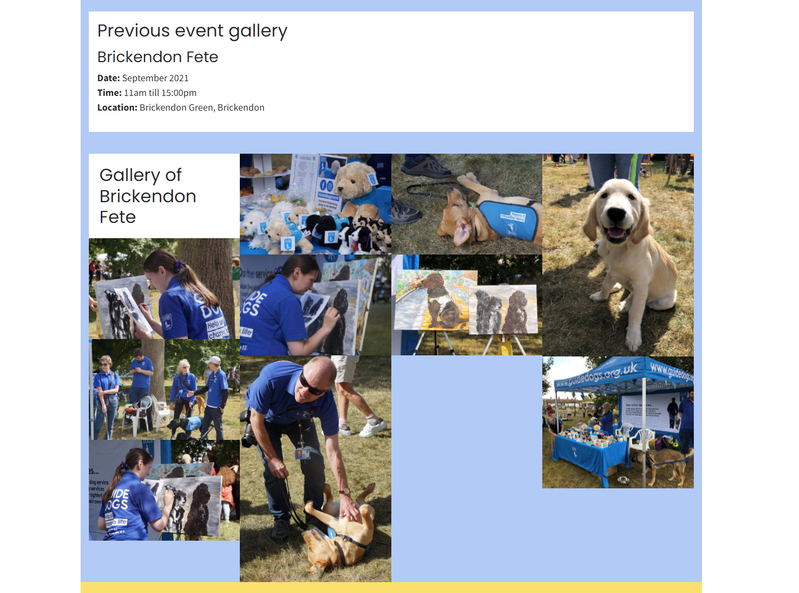  

-  __As a returning visitor, I want to be able to ask a question regarding a service or collaboration__  
Located on the main navigation is a contact us link, when the user selects this, they will see a form that can be filled out to get in touch.  
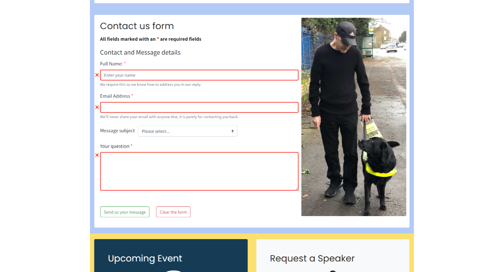  

-  __As a returning visitor, I want to view photos of past events or collections__  
Selecting the events and collections main navigation link will take the use to the events page where they can view a photo gallery  
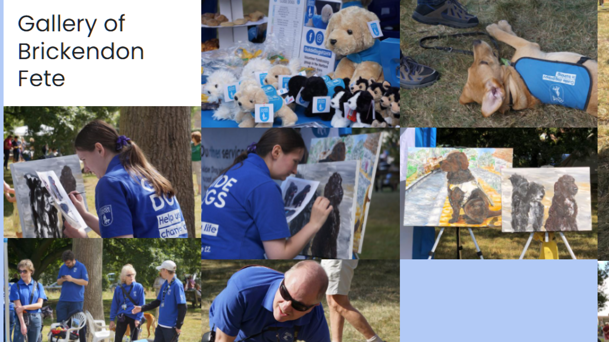  

-  __As a returning visitor, I want to visit the fundraising groups social media pages__
Located on the footer on all pages are the groups social media icon links, selecting one of these will open the social platform in a new tab.  
  

-  __As a returning visitor, I want to know how to book a talk from a speaker/GDO/Puppy walker for my group or school__  
Located above the footer on most pages is a card that reads Request a speaker.
A user can also use the donate link in the main navigation to find a speaker CTA card.  
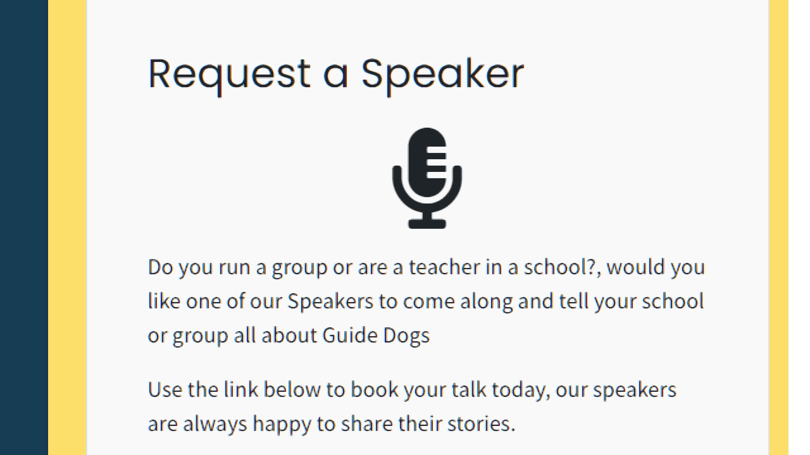  

### Site Owner
-  __As the site owner, I want visitors to find information about upcoming events or collections__  
Located on every page apart from the donate page, there is a card a user can select to be taken directly to the speaker information page on the guide dogs’ main website.  

-  __As the site owner, I want visitors to understand what the groups fundraising goals are, to find out more about the main charity and how it helps visually impaired people.__  
Located on the main navigation is an about us link, selecting this will tell them about the group and the history of guide dogs and how their charity began.  

-  __As the site owner, I want the site visitors to be able to contact the group regarding a service or ask a general question__  
Located on the contact us page is a form which a user can fill out, on the form is a dropdown field to direct the message to the correct person.  

-  __As the site owner, I want site visitors to be able to donate to the group easily.__  
Located on the homepage within the Hero image is a direct Donate through Just Giving link which will allow a user to donate securely through Just Giving secure platform.  

## Testing Overview  
Automated testing
All automated tests were carried out in incognito mode to eliminate extension conflicts or false positives or errors due to the extension requests.  

__Manual testing__  
All manual testing was carried out in standard mode to simulate a standard users experience of the website.
Performance, due to the limited scope of the project’s technology base, certain performance tweaks were not able to be introduced as the project is based on using HTML and CSS.  

__Libraries__  
As the project technologies required HTML and CSS only, certain implementation ways to exclude parts of a library were not used as these would of required JavaScript to customise the bundle size, as such performance results may be affected.  

__Accessibility extensions__  
All results from accessibility extensions were verified using manual tests and where relevant were validated using Screen Reader software.  

__Screen Reader software__  
NVDA and JAWS were used in some tests, this was software which I own and was run in real time and not simulated through an extension or virtual environment.  

## Test results overview  

| Test             | Homepage | About us | Fundraise | Events & Collections | Contact us | Donate |
|------------------|----------|----------|-----------|----------------------|------------|--------|
| HTML Validation  | PASS     | Pass     | PASS      | PASS                 | PASS       | PASS   |
| CSS Validation   | PASS     | N/A      | N/A       | N/A                  | N/A        | PASS   |
| Links            | PASS     | PASS     | PASS      | PASS                 | PASS       | PASS   |
| Tab / Focus      | PASS     | PASS     | PASS      | PASS                 | PASS       | PASS   |
| Landmark / Regio | PASS     | PASS     | PASS      | PASS                 | PASS       | PASS   |
| Screen reader    | PASS     | PASS     | PASS      | PASS                 | PASS       | PASS   |
| Lighthoise - <br>Performance,<br>Accessibility,<br>Best practice,<br>SEO | PASS         |          |           |                      |            |        |

## Validation testing  

### HTML Validation  
-  Homepage - [PASS | Validation link](https://validator.w3.org/nu/?showsource=yes&doc=https%3A%2F%2Fjhodgkins.github.io%2FMSP1-Fundraising-Group%2Findex.html)    
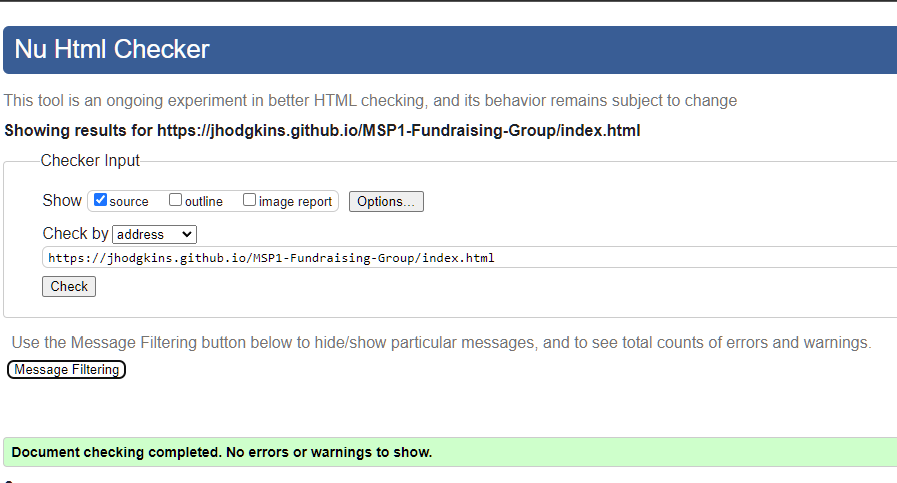  

-  About us - [PASS | Validation link](https://validator.w3.org/nu/?showsource=yes&doc=https%3A%2F%2Fjhodgkins.github.io%2FMSP1-Fundraising-Group%2Fabout-us.html)    
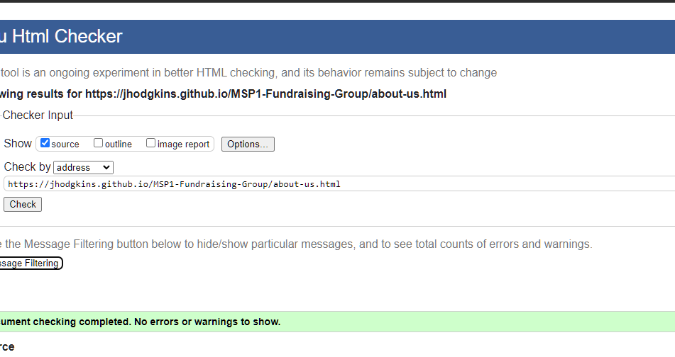  

-  Fundraise - [PASS | Validation link](https://validator.w3.org/nu/?showsource=yes&doc=https%3A%2F%2Fjhodgkins.github.io%2FMSP1-Fundraising-Group%2Ffundraise-with-us.html)     
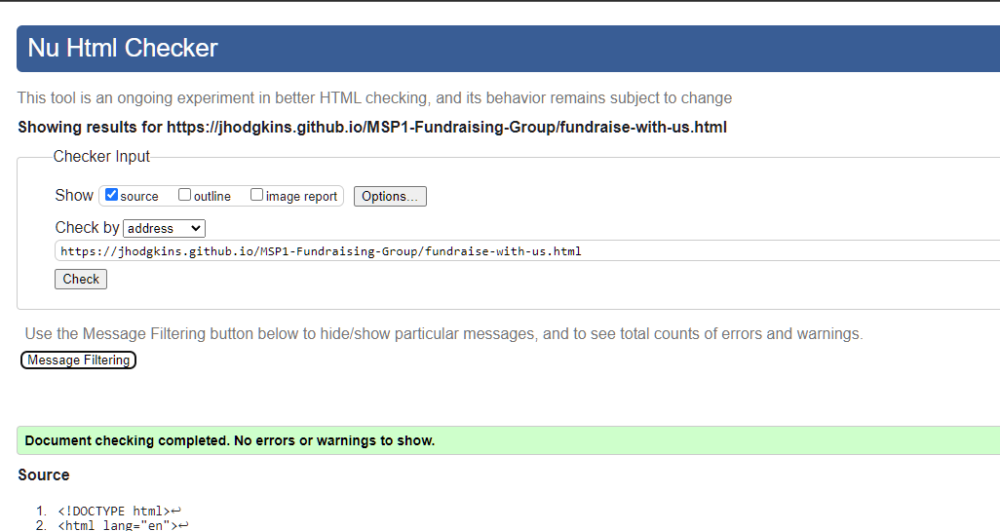  

-  Events and collections - [PASS | Validation link](https://validator.w3.org/nu/?showsource=yes&doc=https%3A%2F%2Fjhodgkins.github.io%2FMSP1-Fundraising-Group%2Fevents-and-collections.html)  
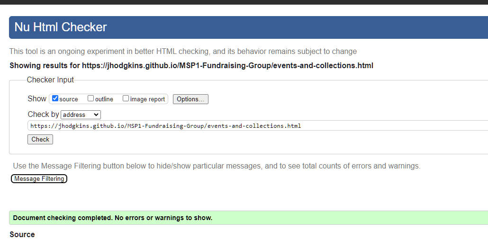  

-  Contact us - [PASS | Validation link](https://validator.w3.org/nu/?showsource=yes&doc=https%3A%2F%2Fjhodgkins.github.io%2FMSP1-Fundraising-Group%2Fcontact-us.html)    
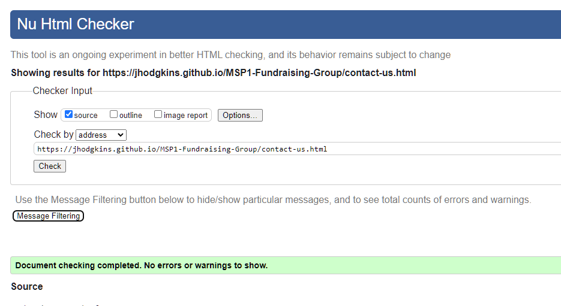  

-  Donate - [PASS | Validation link](https://validator.w3.org/nu/?doc=https%3A%2F%2Fjhodgkins.github.io%2FMSP1-Fundraising-Group%2Fdonate.html)    
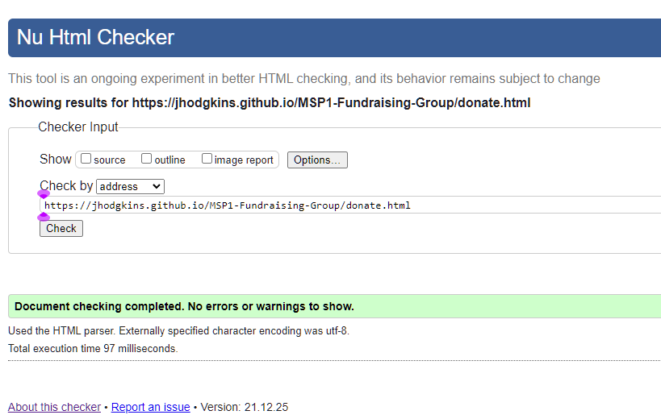  

### CSS Validation  
Two random pages were selected as the validator is assessing the CSS which is loaded on every page.  
Both pages showed a Pass.  
- HomePage [PASS | Validation link](https://validator.w3.org/nu/?showsource=yes&doc=https%3A%2F%2Fjhodgkins.github.io%2FMSP1-Fundraising-Group%2Findex.html)  
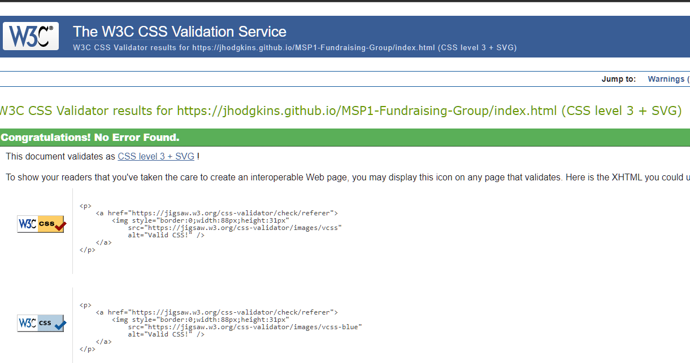  

- Donate [PASS | Validation link](https://validator.w3.org/nu/?showsource=yes&doc=https%3A%2F%2Fjhodgkins.github.io%2FMSP1-Fundraising-Group%2Findex.html)  
  

## Manual tests  

### Browser Render & Responsive test  
Devices used: Windows 10 PC, MacBook Pro, iPad Air 2, iPhone X  
Desktops  
-  Chrome - PASS  
-  EDGE - PASS  
-  Firefox - PASS  
-  Safari on Mac - PASS  
-  Chrome on Mac - PASS  

Tablet  
-  Safari - PASS  

Mobile  
-  Safari - PASS  

Using a combination of devices available to me, I checked all pages and found that the website reflowed and displayed correctly on different screen sizes and systems.  

### Link testing  
All links on the site were tested to ensure that internal links behaved correctly, and that external facing links opened a new tab as expected.  
A screen reader was used during these tests on PC and MAC to ensure that the Sr-Only help text classes which have been applied were announced correctly by the screen reader software.  
an example of the code is shown below:  

```
<a class="btn btn-outline-secondary" href="//widgets.justgiving.com/Button/Redirect?p=eyJJZCI6Ijg3MmFmYzc4LWFkMDYtNDdmMS1iNzI2LTEwODQzZjliYjhkOSIsIkNoYXJpdHlJZCI6MjI2MSwiU2l6ZSI6InMiLCJSZWZlcmVuY2UiOiIiLCJUeXBlIjoiRG9uYXRlIn0=" target="_blank" rel="noopener">
Donate through Just Giving 
<span class="sr-only">(opens Just Giving official site in a new window)</span>
</a>
```  
### Tab order test  
Accessibility insights was used to test tab order on pages.  
The tab order was tested to ensure all focusable elements could receive focus for keyboard only users of the website.  
All pages were tested, and no issues were found.  
  

### Landmarks test  
Screen reader users use landmarks to highlight sections on the page, which can be navigated to using the keyboard.  
These are implemented using HTML5 semantic markup and where appropriate ARIA can be used.  
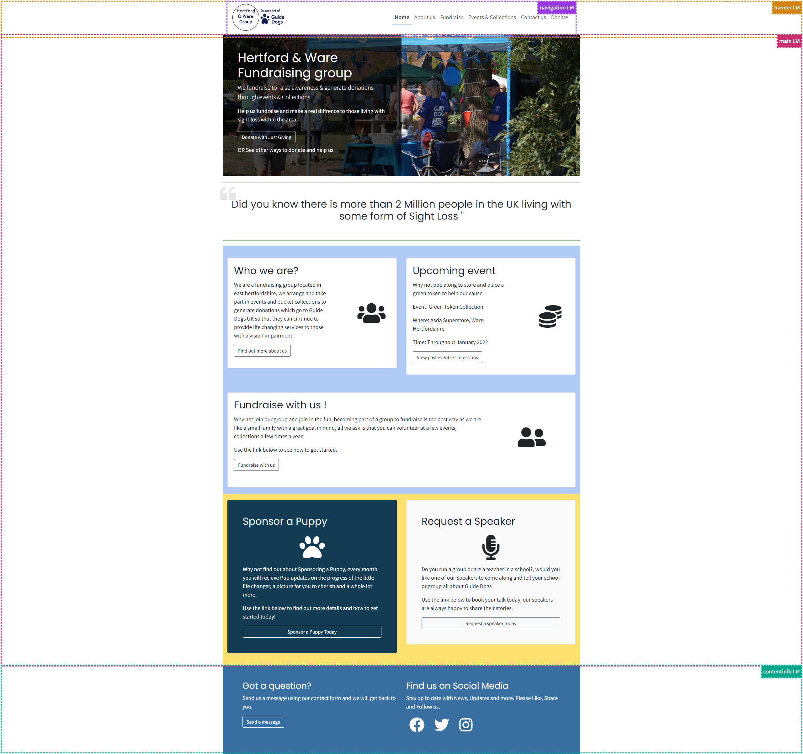  

### Screen Readr testing  
All pages behaved as expected and no keyboard traps were detected.  
Devices used: Windows 10 using NVDA 2021 and JAWS 2021, Mac using VoiceOver for Mac and iPhone X using VoiceOver.  

## Automated tests  

### Lighthouse  
Google Chrome DevTools was used to run and test the Performance, Accessibility, Best practice, and SEO of each page within the website.  
Progressive web app option was not run as this application does not include a service worker or manifest file.  

-  Homepage  

-  About us  

-  Fundraise  

-  Events & Collections  

-  Contact us  

-  Donate  

### Simulated device testing  
This test was carried out using Chromes built in device simulator.  
All simulated screen sizes rendered the website correctly apart from iPhone 5s, which because of the logo size and being a block element pushed the Hamburger menu button down from the top right corner.  
This was resolved by reducing the logo size using media queries to restore the standard mobile appearance.  
A programme called Browserling was also used to test and simulate an operating system back to Win 7 and running IE10. Simulated screens rendered the website correctly.  
[Example of browserling, Win7 IE10](https://www.browserling.com/browse/win7/ie10/https:/jhodgkins.github.io/MSP1-Fundraising-Group/index.html)  
[Example of browserling, win7 firefox 90](https://www.browserling.com/browse/win7/firefox90/https:/jhodgkins.github.io/MSP1-Fundraising-Group/index.html)  

## Issue tracking  

| ID  | Test               | Page     | Issue                | Status  | Action taken          |Comment                          |
|-----|--------------------|----------|----------------------|---------|-----------------------|---------------------------------|
| #1  | DevTools, iPhone<br>5 simulator | All pages | Mobile menu<br>button drops down | not Fixed | Added media query to Css    | Reduced logo size by small amount so<br>both items would stay inline. | 
|     |                    |          |                      |         |                       |                                 |


[Back to Repository](https://github.com/JHodgkins/MSP1-Fundraising-Group)  